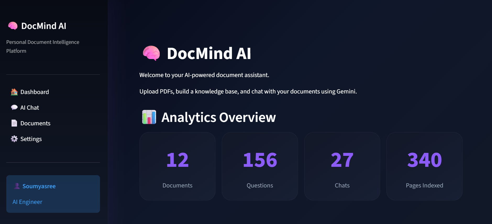
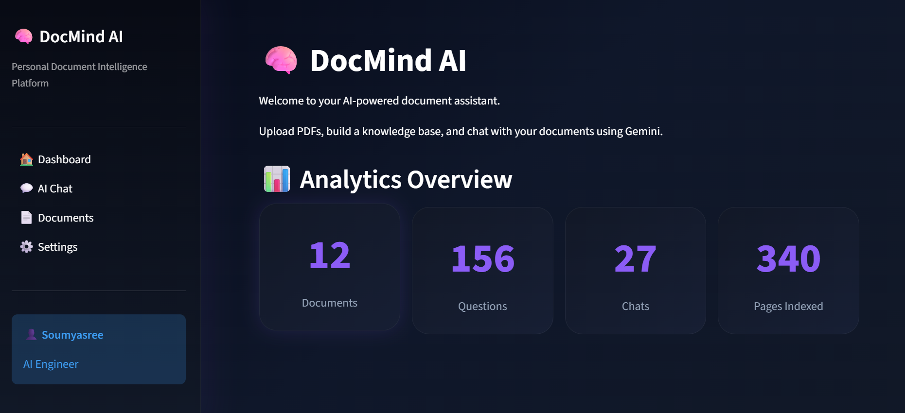
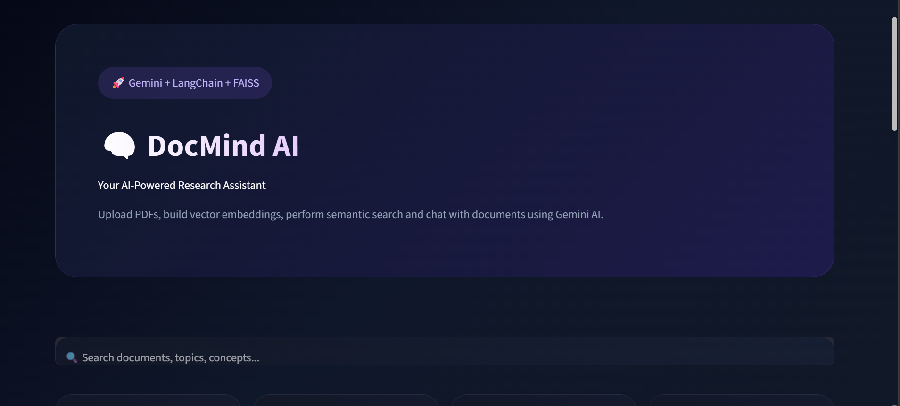
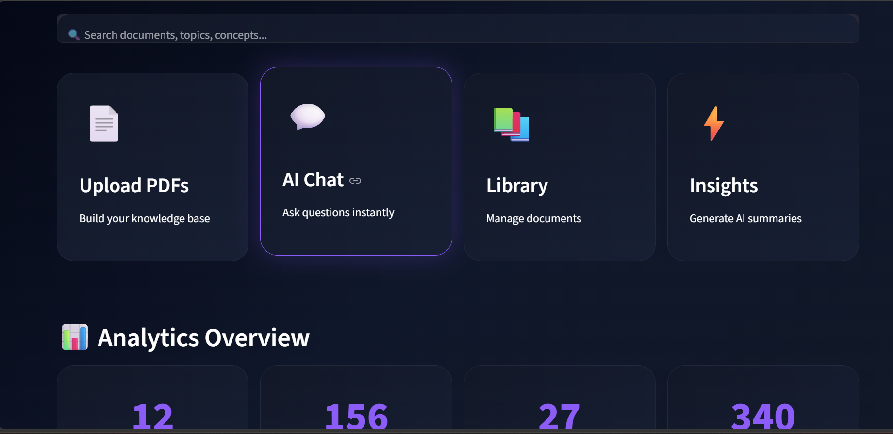
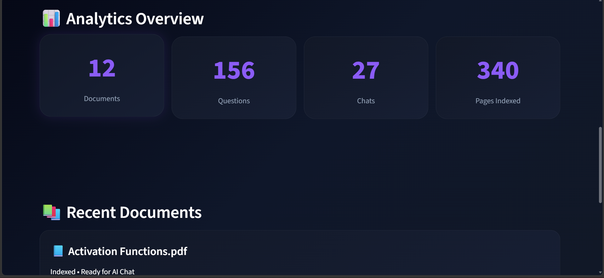
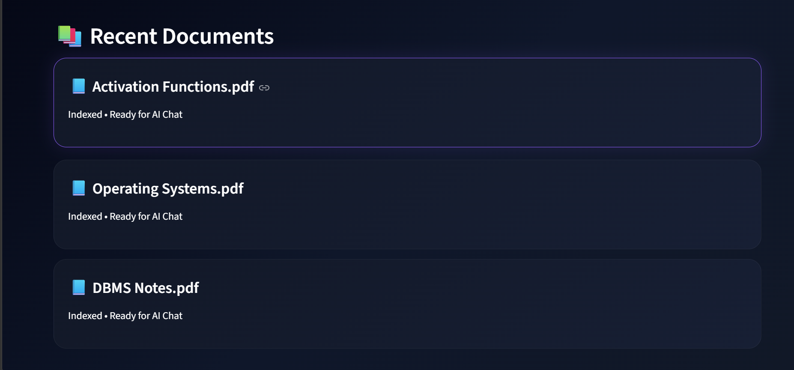
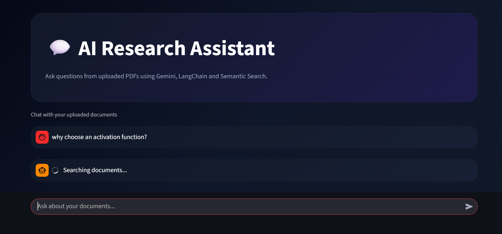
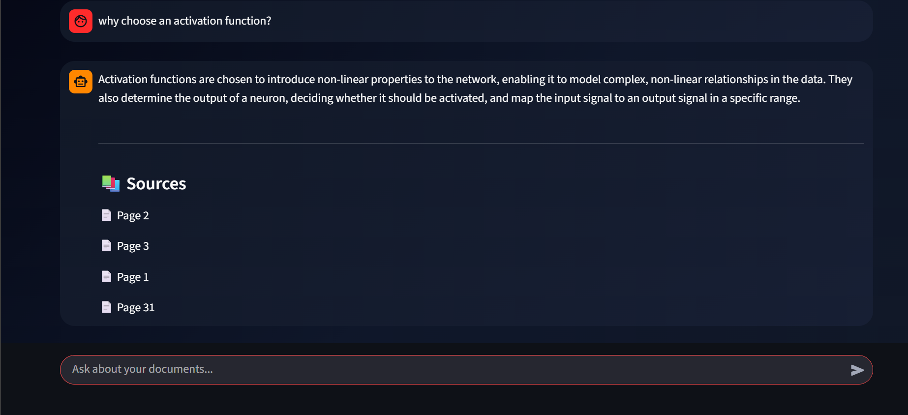
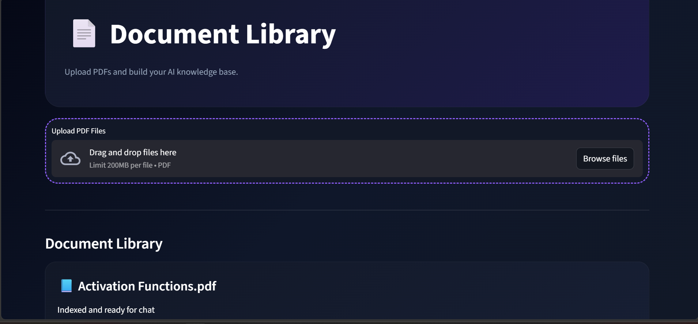
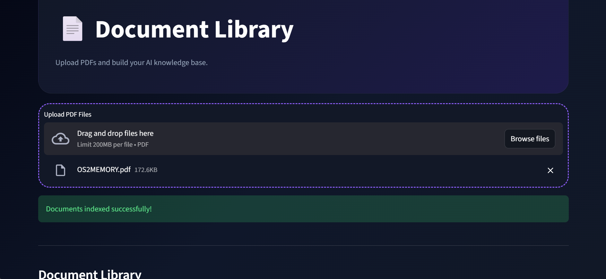

# 🧠 DocMind AI

<div align="center">

# AI-Powered Document Intelligence Platform

Transform PDFs into Intelligent Conversations using Gemini AI, LangChain and FAISS.

<br>


</div>

---

## 🚀 Overview

DocMind AI is a Retrieval-Augmented Generation (RAG) application that enables users to upload PDF documents, build a vector database, perform semantic search, and interact with documents through natural language conversations.

The platform combines Google's Gemini models with LangChain and FAISS to provide accurate, context-aware answers from uploaded documents.

---

# ✨ Features

### 📄 PDF Processing

* Upload PDF documents
* Automatic text extraction
* Intelligent chunking
* Document indexing

### 🧠 AI-Powered Retrieval

* Gemini Embeddings
* FAISS Vector Database
* Semantic Search
* Context Retrieval

### 💬 Conversational Chat

* Natural Language Queries
* Context-Aware Responses
* Source-Based Retrieval
* Interactive AI Assistant

### 🎨 Modern Dashboard

* Premium Dark UI
* Analytics Overview
* Document Library
* Responsive Design

---

# 📸 Screenshots



## 🏠 Dashboard

> Save screenshot as:
>
> `screenshots/dashboard.png`






---

## 💬 AI Research Assistant

> Save screenshot as:
>
> `screenshots/chat.png`




---

## 📄 Document Library

> Save screenshot as:
>
> `screenshots/documents.png`




---

## ⚙️ Settings Page

> Save screenshot as:
>
> `screenshots/settings.png`


---

# 🏗️ Architecture

```text
                PDF Documents
                       │
                       ▼
              Text Extraction
                       │
                       ▼
               Text Chunking
                       │
                       ▼
            Gemini Embeddings
                       │
                       ▼
              FAISS Vector DB
                       │
                       ▼
             Similarity Search
                       │
                       ▼
               Relevant Chunks
                       │
                       ▼
                 Gemini LLM
                       │
                       ▼
                Final Answer
```

---

# 🛠️ Tech Stack

| Category       | Technology        |
| -------------- | ----------------- |
| Language       | Python            |
| Frontend       | Streamlit         |
| LLM            | Gemini 2.5 Flash  |
| Embeddings     | Gemini Embeddings |
| Framework      | LangChain         |
| Vector Store   | FAISS             |
| PDF Processing | PyPDF             |
| Styling        | Custom CSS        |

---

# 📂 Project Structure

```text
DocMind-AI/
│
├── app.py
│
├── assets/
│   └── styles.css
│
├── pages/
│   ├── Dashboard.py
│   ├── Chat.py
│   ├── Documents.py
│   └── Settings.py
│
├── uploads/
│
├── utils/
│   ├── qa_chain.py
│   ├── rag_pipeline.py
│   ├── vector_store.py
│   └── chatbot.py
│
├── screenshots/
│   ├── dashboard.png
│   ├── chat.png
│   ├── documents.png
│   └── settings.png
│
├── requirements.txt
└── README.md
```

---

# ⚙️ Installation

### Clone Repository

```bash
git clone https://github.com/YOUR_USERNAME/docmind-ai.git

cd docmind-ai
```

### Create Virtual Environment

```bash
python -m venv venv
```

### Activate Environment

Windows:

```bash
venv\Scripts\activate
```

Linux / Mac:

```bash
source venv/bin/activate
```

### Install Requirements

```bash
pip install -r requirements.txt
```

### Create .env

```env
GOOGLE_API_KEY=YOUR_GEMINI_API_KEY
```

### Run Application

```bash
streamlit run app.py
```

---

# 🔄 Workflow

### Step 1

Upload PDF documents.

### Step 2

Extract and split text into chunks.

### Step 3

Generate embeddings using Gemini.

### Step 4

Store vectors in FAISS.

### Step 5

Ask questions in natural language.

### Step 6

Retrieve relevant document chunks.

### Step 7

Generate context-aware answers using Gemini.

---

# 🎯 Resume Highlights

* Built an end-to-end Retrieval-Augmented Generation (RAG) system.
* Implemented semantic search using FAISS vector database.
* Integrated Google Gemini for embeddings and question answering.
* Developed a document ingestion and retrieval pipeline using LangChain.
* Designed a premium SaaS-style dashboard using Streamlit.
* Enabled conversational interaction with PDF documents.

---

# 🔮 Future Enhancements

* Multi-document chat
* Persistent chat history
* Authentication
* Cloud deployment
* PDF summarization
* Citation highlighting
* OCR support
* Multi-user workspaces

---

# 👩‍💻 Author

### Soumyasree Mitra

Aspiring AI/ML Engineer • Data Science Enthusiast • Full Stack Learner

---

<div align="center">

⭐ If you like this project, consider starring the repository.

Built with ❤️ using Gemini, LangChain, FAISS and Streamlit.

</div>
